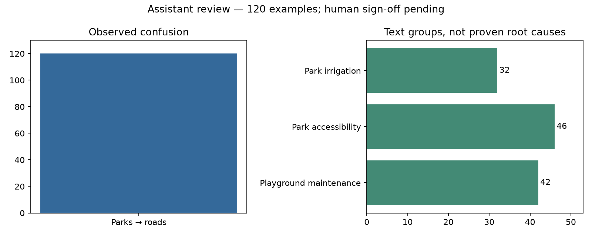

# EVALUATION REPORT — Bayan

Validation performance reaches the ceiling of this synthetic dataset, while the retrieval system misses the supplied exact-ID targets. Gulf generalisation remains unmeasurable, and the required human error review is pending.

## Sliced metrics with 95% bootstrap intervals

500 seeded bootstrap draws; citizen groups are resampled together. All eight topic labels stay in macro-F1, including absent labels. Slices with fewer than 30 groups are flagged. These are validation estimates, not new frozen-test results.

| Model / slice | Rows | Macro-F1 [95% CI] | Small slice |
|---|---:|---|---|
| topic / all | 2400 | 1.0000 [1.0000, 1.0000] | False |
| topic / lang=ar | 1200 | 0.5000 [0.5000, 0.5000] | False |
| topic / lang=en | 1200 | 0.5000 [0.5000, 0.5000] | False |
| topic / dialect_region=MSA | 1200 | 0.5000 [0.5000, 0.5000] | False |
| topic / dialect_region=unknown | 1200 | 0.5000 [0.5000, 0.5000] | False |
| topic / y_true=billing | 300 | 0.1250 [0.1250, 0.1250] | False |
| topic / y_true=digital_services | 300 | 0.1250 [0.1250, 0.1250] | False |
| topic / y_true=licensing | 300 | 0.1250 [0.1250, 0.1250] | False |
| topic / y_true=lighting | 300 | 0.1250 [0.1250, 0.1250] | False |
| topic / y_true=parks | 300 | 0.1250 [0.1250, 0.1250] | False |
| topic / y_true=roads | 300 | 0.1250 [0.1250, 0.1250] | False |
| topic / y_true=waste | 300 | 0.1250 [0.1250, 0.1250] | False |
| topic / y_true=water | 300 | 0.1250 [0.1250, 0.1250] | False |
| topic / length_bucket=medium | 690 | 1.0000 [0.8750, 1.0000] | False |
| topic / length_bucket=short | 1710 | 1.0000 [1.0000, 1.0000] | False |
| topic / dialect_region=Gulf | 0 | Unavailable | N/A |
| dialect_aware / all | 1200 | 0.5000 [0.5000, 0.5000] | False |
| dialect_aware / lang=ar | 1200 | 0.5000 [0.5000, 0.5000] | False |
| dialect_aware / dialect_region=MSA | 1200 | 0.5000 [0.5000, 0.5000] | False |
| dialect_aware / y_true=digital_services | 300 | 0.1250 [0.1250, 0.1250] | False |
| dialect_aware / y_true=lighting | 300 | 0.1250 [0.1250, 0.1250] | False |
| dialect_aware / y_true=parks | 300 | 0.1250 [0.1250, 0.1250] | False |
| dialect_aware / y_true=water | 300 | 0.1250 [0.1250, 0.1250] | False |
| dialect_aware / length_bucket=medium | 72 | 0.5000 [0.5000, 0.5000] | False |
| dialect_aware / length_bucket=short | 1128 | 0.5000 [0.5000, 0.5000] | False |
| dialect_aware / dialect_region=Gulf | 0 | Unavailable | N/A |

Paired topic minus DA macro-F1 on the same Arabic rows: {"point": 0.0, "low": 0.0, "high": 0.0, "n": 1200, "groups": 480, "small_slice": false}. No Gulf rows are present.

## Behavioural suite

| Model | Invariance | MFT | Directional |
|---|---|---|---|
| topic | 200/200 | 15/16 | Not assessable: topic model has no sentiment output |
| dialect_aware | 200/200 | 9/16 | Not assessable: topic model has no sentiment output |

Separate TF-IDF sentiment baseline: 200/200 directional checks passed, with 200 unchanged predictions. Validation sentiment macro-F1=0.3333. The test permits ties; this result does not demonstrate sensitivity to negation. Training uses only the supplied training split.

Invariance uses the supplied 200 templates with whitespace perturbations. Sixteen explicit bilingual topic probes supplement the supplied file, which has no MFT rows. The 200 directional templates require sentiment output; topic probabilities cannot substitute for sentiment. DA English probes are deliberately reported as an out-of-scope stress test.

## Error taxonomy

Human-confirmed review: **0/120**. Review [the worksheet](docs/LAB6_ERROR_REVIEW.md) and record decisions in `artifacts/lab6/human_error_review.json`. The worksheet samples the course-provided predictions, which contain 300 errors; our saved topic validation predictions contain no errors. These two sources are not interchangeable.

Confirmed-category histogram: {}. No automatic categories count as human review.

Assistant-review evidence: **120/120** entries annotated. The sample repeats three scenarios: playground maintenance (42), park accessibility (46), and park irrigation (32). All have the observed confusion parks → roads. This is not an established model-internal cause.

Read the [short grouped review](docs/LAB6_QUICK_REVIEW.md); per-entry suggestions are in `artifacts/lab6/assistant_error_review.json`. Human confirmations above are unchanged. Instructor acceptance is required if this replaces the specified human review.

Using gold labels only as an accounting exercise, correcting the 120 sampled predictions would add 8.42 macro-F1 points; correcting all 300 supplied errors would add 16.67. These are correction ceilings, not trained-model gains. Source predictions remain unchanged.

### Top three proposed fixes (not measured promises)

- Verify the supplied prediction file and label-ID mapping against its generating model before diagnosing model internals: Unknown until provenance is verified. Oracle scenarios quantify the maximum available correction, not a promised gain.
- Add paired parks-versus-roads probes covering park walkways and road words inside place names: Unknown; these probes measure whether the hypothesized shortcut exists before any retraining.
- Compare clean/noisy versions of park complaints while holding the correct label fixed: Unknown; secondary spelling features are observations, not established causes.

## Retrieval quality

Reranked recall@10=0.0231; MRR@10=0.0265. Empty-correct=20/20 on the calibration queries, which contain only one unique no-answer text. This is not independent rejection accuracy. See `artifacts/lab5/retrieval.json`.

## Known limitations

- All source data are synthetic; repeated templates limit generalisation claims.
- No Gulf validation rows, no Arabic topic test rows, and only four NER validation template groups.
- Exact-ID retrieval labels are sparse among 20,000 repeated cases; original labels remain unchanged.
- Human review is not complete; directional probes pass through ties on a weak separate sentiment baseline. The Lab 6 targets must not be marked fully achieved.
- Confidence intervals describe this dataset and resampling protocol; they do not repair missing dialect or entity coverage.
