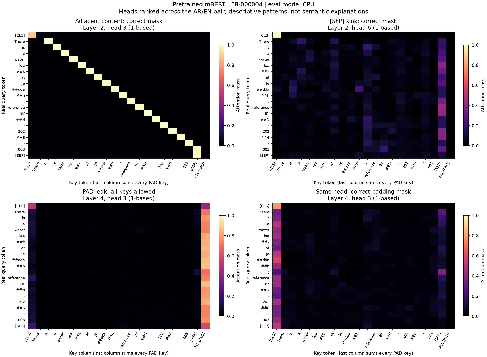
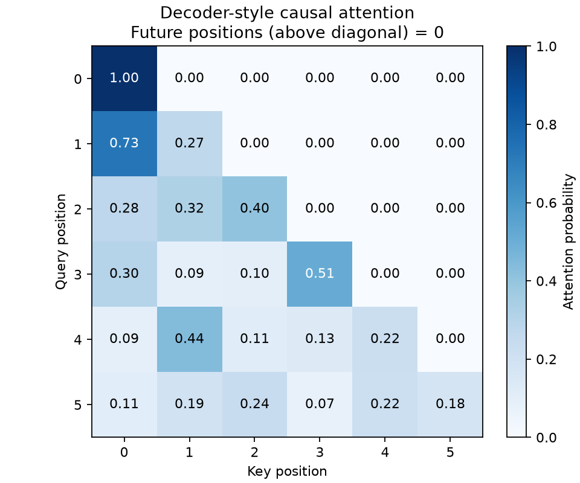

# Lab Notes

## Lab 1 — Defect Safari
Inspect `data/raw/bayan_raw_sample.csv` and document at least six defect classes.
For each one record: example, why it matters, and clean/preserve/task-dependent.

### Defect 1
- Class: Tatweel / decorative elongation
- Example: `الخدمــــة` and `مـشكلة`
- Why it matters: these are the same lexical forms but create different token sequences.
- Decision: clean — remove U+0640 tatweel before tokenisation.

### Defect 2
- Class: Repeated-character emphasis
- Example: `لووووسمحت` and English `pleaseeee`
- Why it matters: expressive elongation inflates sequence length and vocabulary sparsity.
- Decision: clean conservatively — reduce runs of 3+ to two characters, retaining emphasis.

### Defect 3
- Class: Irregular whitespace and line breaks
- Example: leading/trailing spaces in `The fees for Balady are unclear`, plus `<br>`-adjacent spacing.
- Why it matters: equivalent feedback should not tokenize differently because of layout.
- Decision: clean — collapse all Unicode whitespace and trim.

### Defect 4
- Class: Saudi phone and national-ID-shaped PII
- Example: `0551234567`, `+966551234567`, and `1023456789` in feedback rows 1, 38, and 42.
- Why it matters: PII must not reach training, evaluation, or serving logs in raw form.
- Decision: clean — replace with `<PHONE>` and `<NATIONAL_ID>` before normalisation.

### Defect 5
- Class: Arabic/English code-switching and product identifiers
- Example: `BYN-2026-000003`, English service names within Arabic feedback, and Arabic location names.
- Why it matters: bilingual model selection must preserve service and reference context.
- Decision: preserve — tokenizers should learn these forms; no transliteration or lowercasing.

### Defect 6
- Class: Emoji and HTML remnants
- Example: `😡` and terminal `<br>` (for example rows 1, 32, and 63).
- Why it matters: emoji is sentiment signal, whereas the HTML fragment is source-system noise.
- Decision: task-dependent — preserve emoji in the shared normaliser; remove/parse HTML only in a separately versioned source-ingestion rule if required.

### Sentence-segmentation spot check
- Arabic multi-sentence complaint: `الماء منقطع منذ الصباح. أرجو إرسال فني اليوم؟ شكراً!` split into 3 sensible sentences.
- English multi-sentence complaint: a `p.m.` abbreviation stayed joined to `yesterday.`; the example split into 3 sentences.
- Numbered-list complaint: `1. الإنارة ... 2. توجد حفرة ... 3. الحاوية ...` yielded one complete sentence per list item.
- Reference/abbreviation example: `Dr. Ali` remained together; the reference sentence and follow-up were split separately.
- Arabic emphatic complaint: `!!!` is conservatively normalised to `!!`, then `؟` and `.` create sensible boundaries.

### Token-length histogram follow-up — 2026-09-10

The missing sequence-length histogram is now generated by `notebooks/01_tokenizer_audit.py` and saved under `artifacts/lab1/` with exact bin counts and pinned tokenizer revisions. It uses the same unmodified raw feedback corpus as the original table. Percentages are normalized within each language because the audit has 7,200 Arabic and 4,800 English rows. XLM-R remains the balanced bilingual choice (p95 21/23); the figure also exposes CAMeLBERT's longer English and DistilBERT's longer Arabic sequences. The 26 original Lab 1 checks passed, and all eight distributions have verified row totals and p95 values.

## Lab 2 — Parameter audit

### التطبيق خطوة بخطوة

1. **Attention:** حسبنا `Q @ Kᵀ / √d_k`، وطبّقنا القناع قبل `softmax`، ثم ضربنا الأوزان في `V`. الخيار `need_weights=True` يرجّع الأوزان لفحصها، والاستدعاء الأصلي يرجّع المخرجات فقط.
2. **Multi-Head Attention:** أضفنا إسقاطات متعلّمة لـQ وK وV، وقسّمناها إلى رؤوس، ثم جمعنا نتائج الرؤوس ومرّرناها عبر إسقاط الإخراج. قارنّا المخرجات والأوزان والمشتقات مع PyTorch باستخدام نفس الأوزان.
3. **حساب البارامترات:** قرأنا إعدادات النسخ المحدّدة من النموذجين وعددنا أشكال البارامترات على جهاز `meta`؛ حساب العدد لا يحتاج تنزيل أوزان التدريب. النطاق هنا هو `BertModel` مع pooler، بدون رأس MLM أو تصنيف.
4. **Causal mask:** أضفنا قناعًا يسمح للموضع `i` بالنظر إلى المواضع `≤ i` فقط. اختبرنا أن كل الأوزان فوق القطر صفر وأن تغيير قيمة مستقبلية لا يغيّر المخرجات السابقة. هذا نمط **Decoder-style causal attention**؛ النموذجان BERT نفسيهما encoder ثنائي الاتجاه.
5. **تشخيص الخرائط:** شغّلنا mBERT المدرّب على مثال عربي وآخر إنجليزي من بيان، مرة بقناع صحيح ومرة بالسماح لكل المواضع. قسنا الانتباه إلى PAD من الاستعلامات الحقيقية فقط؛ المتوسط انخفض من **15.661530% إلى صفر**.
6. **التحقق:** نجحت اختبارات اللاب، وأنتج السكربت خرائط مشروحة وملف JSON بالأرقام. الأوامر أدناه تعيد التجربة.

| Checkpoint | Total params | Embeddings % | Other notes |
|---|---:|---:|---|
| mBERT | 177,853,440 | 51.84% | Vocabulary 119,547; 92,206,848 embedding parameters |
| CAMeLBERT | 109,081,344 | 21.48% | Vocabulary 30,000; 23,434,752 embedding parameters |

The embedding share is larger in mBERT because its multilingual vocabulary has 119,547 entries versus CAMeLBERT's 30,000, while both use hidden size 768 and 12 encoder layers (the multilingual vocabulary tax).

| Parameter bucket | mBERT | CAMeLBERT |
|---|---:|---:|
| Word + position + token-type embeddings | 92,206,848 | 23,434,752 |
| Attention Q/K/V + output projections | 28,348,416 | 28,348,416 |
| FFN | 56,669,184 | 56,669,184 |
| All LayerNorm weights and biases | 38,400 | 38,400 |
| Pooler | 590,592 | 590,592 |
| Other | 0 | 0 |

- Buckets are disjoint: embedding LayerNorm belongs to **norms**, not embeddings. Total includes the base-model pooler and excludes MLM/task heads. These are architecture counts, not a claim that task-head weights were audited.
- Config revisions: mBERT `3f076fdb1ab68d5b2880cb87a0886f315b8146f8`; CAMeLBERT `9be352797bdf28a9ae21e2ae582aaaca7abdb22d`.
- Config sources: [mBERT](https://huggingface.co/bert-base-multilingual-cased/blob/3f076fdb1ab68d5b2880cb87a0886f315b8146f8/config.json), [CAMeLBERT](https://huggingface.co/CAMeL-Lab/bert-base-arabic-camelbert-mix/blob/9be352797bdf28a9ae21e2ae582aaaca7abdb22d/config.json).
- Reproducible machine-readable counts: [parameter_audit.json](artifacts/lab2/parameter_audit.json).

### Attention-map findings and pad leakage

- Actual pretrained mBERT weights, pinned revision above, CPU float32, `eval()` and eager attention; dropout disabled. Inputs: preprocessed `FB-000001` (AR, 41 real + 23 PAD tokens) and `FB-000004` (EN, 21 real + 43 PAD tokens), padded to 64.
- **Adjacent-content head:** layer 2 / head 3 assigns 96.55% mean mass to immediately neighbouring content tokens. The English map shows the stripe one position after the query.
- **SEP concentration:** layer 2 / head 6 has the largest mean mass on `[SEP]`, 20.17% across content queries in this pair. It is a partial sink, not exclusive attention to SEP.
- **Pad leak:** layer 4 / head 3 has 69.79% mean PAD mass across content queries when the mask is deliberately replaced with all ones. The same head has zero PAD mass with the correct mask.
- Head numbers are **1-based**. Heads are ranked across both examples; the annotated figure displays the English example and sums all PAD columns into its final column. These are descriptive observations from two synthetic examples, not corpus-wide results or explanations of model decisions.
- Root cause: padded positions still have position/type embeddings and hidden states, so omitting the key mask allows probability mass to reach them. Mask keys **before softmax** and exclude padded query rows when reporting the metric; masking key columns does not itself zero padded query outputs.
- Mask conventions: our `attention(mask=...)` and functional PyTorch SDPA use boolean **True = allowed**; `MultiHeadAttention(key_padding_mask=...)` and PyTorch's module padding mask use **True = ignore**. Floating masks use `0` / `-inf`.
- Regressions assert zero future attention, zero masked PAD mass, equivalence to PyTorch at `atol=1e-6, rtol=0`, stable outputs after changing masked values, and finite gradients for fully blocked rows.





Run from the project directory:

```bash
source .venv/bin/activate
make lab2
```

This runs the attention and parameter-bucket tests, writes `artifacts/lab2/parameter_audit.json`, then runs the anatomy script to regenerate the images and [attention_diagnostics.json](artifacts/lab2/attention_diagnostics.json). The first run needs network access for model files; later runs use the local cache. Downloaded weights stay in ignored `artifacts/hf_cache/`; small Lab 2 evidence files are allowed by `.gitignore`.

## Lab 3 — Implementation rationale and data findings

الشرح التفصيلي لكل خطوة وسببها في [مراجعة لاب ٣](docs/LAB3_WALKTHROUGH.md). القرارات في `DECISIONS.md#lab3-training`، والأرقام النهائية في `BENCHMARKS.md`.

- Topic: the supplied 8,400/2,400/1,200 split has zero citizen overlap. After Lab 1 preprocessing, 1,762 validation rows have text already present in training. High scores on these synthetic templates do not establish production generalisation.
- TF-IDF vocabulary and IDF are fitted on training only. Topic label IDs are also derived from training only. The baseline reached 1.0000 validation macro-F1; the +8-point target must be assessed honestly against the final baseline, not by altering it.
- Final test coverage: only digital_services, lighting, parks and water are present (300 each). Both saved models classified all 1,200 examples correctly. The fixed-eight-class macro-F1 is 0.5000 because absent classes score zero; accuracy is 1.0000 and the measured model delta is 0.00 points. No test predictions or metric values were changed when adding this coverage explanation.
- NER: 4,000 CoNLL sentences; 644 SERVICE cells contain multiple whitespace-separated words. Expanding those cells adds 644 I-SERVICE labels and preserves complete entity boundaries. No ORGANISATION labels are present, despite the documented schema.
- NER grouping: replacing reference values in the grouping key reveals 18 templates. Deterministic split: train 12 templates/2,674 rows, validation 4/935, test 2/391; zero template overlap.
- Measured NER result: strict entity-F1 1.0000 on validation and 1.0000 on the held-out test; training runtime 245.71 seconds on MPS. The saved checkpoint was selected using validation only. A NumPy-to-JSON export issue was repaired using saved results, without retraining or repeating the frozen test.
- QA smoke mismatch: supplied file has 12 answerable rows, three unique questions, zero nulls. The original file is unchanged. A separate 9-answer/3-null diagnostic was selected from three other contexts before inference, and the threshold was calibrated on 144 unique questions from 36 disjoint development contexts.
- Tests cover citizen leakage, preserved split assignments, unseen labels, first-subword alignment, compound BIO boundaries, template grouping, QA token restrictions, span length/order, null thresholds and development/test context separation.
- Machine-readable audit: [data_audit.json](artifacts/lab3/data_audit.json). Saved models use the same pretrained checkpoint revisions recorded in their metrics; checkpoint selection never uses frozen-test performance.

## Lab 4 — Dialect audit and Arabic preprocessing

الشرح خطوة بخطوة في [مراجعة لاب ٤](docs/LAB4_WALKTHROUGH.md).

- Distribution: 7,200 Arabic rows; Gulf 4,800 (66.67%), MSA 2,400 (33.33%). These are supplied metadata labels, not predictions from a dialect classifier.
- Split coverage: Arabic train = 4,800 Gulf + 1,200 MSA; Arabic validation = 1,200 MSA only; frozen test contains no Arabic rows. There is no unseen Gulf evaluation slice in the supplied assignments.
- MSA-only evaluation excludes the Gulf majority and cannot establish Gulf generalisation. A representative unseen Gulf evaluation set is needed before claiming a dialect-specific gain.
- Two profiles: `bayan_ar_v1` follows the golden letter folds; project-defined `camelbert_v1` removes diacritics/tatweel without letter folding. Display spelling is retained separately after PII masking.
- The 30 golden cases contain only 10 unique input/output pairs. Additional regressions cover profile differences, idempotence, PII-safe display text, source-word alignment and empty dialect slices.
- CAMeL resources: MLE + morphology for `calima-msa-r13`, D3 scheme; `وبالرياض` becomes `و+ ب+ ال+ رياض`. English words, dates and reference IDs stay intact in the NER path.
- Paired NER validation ablation: LOCATION recall 1.0000 → 0.763636, delta −23.6364 points; aggregate entity micro-F1 1.0000 → 0.940909. Keep the unsegmented input path for the saved Lab 3 model. No frozen-test inference was repeated.
- Segmented training is available via `scripts/train_ner.py --segmentation camel_d3 --output-dir artifacts/ner_d3`; it uses the same stem mapping for train/eval. This follow-up was completed on 2026-09-09: three epochs on 2,674 training sentences, 282.92 seconds on MPS. On the same 935 validation sentences, LOCATION recall and entity micro-F1 both recovered to 1.0000. Gain against the original baseline is 0 points, so the +4 target remains unmet and the original model is retained. The frozen test was not used.
- Measured artifacts: [dialect audit](artifacts/lab4/dialect_audit.json), [profile/segmentation examples](artifacts/lab4/preprocessing_examples.json), [NER comparison](artifacts/lab4/ner_segmentation.json).

- D3 follow-up evidence: [training](artifacts/lab4/ner_d3_training.json), [paired comparison](artifacts/lab4/ner_d3_comparison.json), [saved-model reload check](artifacts/lab4/ner_d3_reload_check.json).

## Labs 5–7 — Implementation and measured integration (2026-09-09)

- Implemented normalized FAISS persistence, multilingual two-stage search and the complete retrieval evaluation. Exact-ID recall/MRR targets remain unmet; negative calibration has only one unique text. Original corpus and labels are unchanged.
- Implemented bootstrap intervals, 16 topic slices, behavioural probes, three model cards and the evaluation report. Topic invariance 200/200, MFT 15/16. Prepared 120 supplied-course errors for human review; zero are falsely counted as reviewed.
- Exported classifier and NER to ONNX and INT8, preserved fp32 rollback, measured the full CPU ladder and paired quality. INT8 agrees with all saved validation predictions.
- Assembled all service endpoints and startup canaries. Final 16-client/60-second HTTP test: p99 33.36 ms, 33,259 requests, zero errors. Bounded microbatching addressed concurrent queueing without caching results.
- Full unit/contract suite: 140 passed. Remaining mandatory evidence and optional work deferred at the user's request are listed in [the runbook](docs/LABS_5_7_RUNBOOK.md). The 120-error human review is deferred until the user returns to it.

## Lab 6 — Grouped assistant review (2026-09-10)

Read all 120 sampled texts and supplied assistant explanations for every ID. They contain 45 exact texts and three scenarios (42 playground, 46 accessibility, 32 irrigation); all are parks predicted as roads. All 300 errors in the supplied prediction file share that label confusion. Visible orthographic noise occurs in 13 sampled rows, but is not established as causal. The short review and assistant histogram reduce repetition without claiming human sign-off. Original review answers and course/data files remain unchanged.
