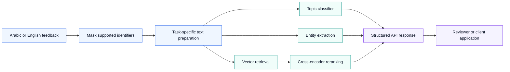
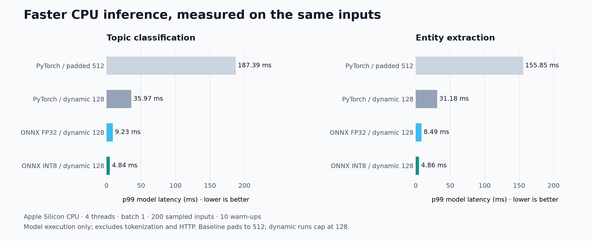

<div align="center">

# Jana Alhumaizi NLP

### Bilingual feedback. Structured insight. Measured performance.

An Arabic and English NLP prototype that turns citizen feedback into service topics, named entities, and searchable historical cases.

**Arabic + English · Transformer models · Semantic search · FastAPI · ONNX INT8**

[Architecture](#how-it-works) · [Results](#measured-results) · [Run locally](#run-locally) · [Technical evidence](#explore-the-project)

</div>

---

## The opportunity

Citizen-service teams receive free-text complaints that vary in language, spelling, and detail. Reading each message, identifying the responsible service, and locating related cases takes time and makes consistent handling difficult.

**Jana Alhumaizi NLP demonstrates how one NLP service can support that workflow.** It prepares bilingual text, masks supported personal identifiers, predicts one of eight service topics, extracts useful entities, and searches a corpus of 20,000 historical cases. A separate extractive question-answering component selects answers from supplied context.

Built by **Jana Alhumaizi** as an applied project for **SDA-AIE-211 — Natural Language Processing with Transformers**. Current status: **working educational prototype evaluated on synthetic data**.

## Value for a service team

| Business need | What the project provides | Intended benefit |
|---|---|---|
| Organise incoming feedback | Topic classification across billing, digital services, licensing, lighting, parks, roads, waste, and water | Support consistent triage and routing. |
| Understand the important details | Named entity recognition (NER) for locations, dates, references, and services | Help reviewers find key facts without reading every sentence repeatedly. |
| Handle Arabic and English together | Shared multilingual models and explicit Arabic preprocessing profiles | Support a common workflow across both languages. |
| Find related historical cases | Vector retrieval followed by a multilingual reranker | Surface potentially relevant cases for a reviewer. |
| Limit exposure of supported identifiers | Phone and national-ID masking before model use | Reduce exposure of these identifiers in the processing pipeline. |
| Integrate with existing systems | Typed HTTP endpoints, model manifests, and startup checks | Provide a defined interface for a future portal or case-management integration. |

The workflow is designed to help service teams organise feedback, inspect key details, and explore related cases through one interface.

## Project highlights

- **One bilingual workflow:** Arabic and English feedback share classification, entity extraction, and search interfaces.
- **Fast CPU execution:** the optimised classifier achieved **4.84 ms p99 model latency** in the recorded benchmark.
- **Connected analysis:** one API request combines a topic prediction, extracted entities, and historical-case candidates.
- **Traceable model delivery:** pinned checkpoints, versioned preprocessing, artifact checksums, and startup checks make the deployed components identifiable.
- **Evidence-backed optimisation:** saved timing runs and paired FP32/INT8 comparisons support the performance results below.

## How it works



The combined `/v1/analyse` endpoint assembles classification, entities, and search. Extractive QA runs through dedicated lab scripts. Entity offsets refer to the returned PII-masked text.

## Tools and why they were chosen

| Technology | Role | Reason for the choice |
|---|---|---|
| **Python 3.12, PyTorch, Hugging Face Transformers** | Training and model inference | A shared workflow for pretrained checkpoints, fine-tuning, token alignment, and export. |
| **XLM-R** | Bilingual classification and NER | The tokenizer audit showed a balanced Arabic/English representation; one backbone supports both tasks. |
| **CAMeL Tools and CAMeLBERT** | Arabic normalisation, clitic segmentation, and Arabic model experiments | Make Arabic-specific preprocessing choices explicit and measurable. |
| **scikit-learn** | TF-IDF baseline and evaluation | Provides a transparent baseline against which to assess transformer results. |
| **Multilingual MiniLM and FAISS** | Case embeddings and vector search | Retrieve candidates from a shared Arabic/English vector space using normalised similarity. |
| **Multilingual cross-encoder** | Rerank retrieved cases | Score the query and case together after the initial candidate search. |
| **ONNX Runtime and INT8 quantisation** | CPU inference | Reduce measured inference latency while checking agreement against saved FP32 predictions. |
| **FastAPI and Pydantic** | HTTP service and input validation | Expose predictable request/response interfaces with interactive API documentation. |
| **pytest, bootstrap evaluation, Matplotlib** | Verification and reporting | Check contracts, quantify uncertainty, and make measured evidence inspectable. |

Exact model revisions, preprocessing versions, and artifact checksums are recorded in the [benchmark evidence](BENCHMARKS.md) and model manifests.

## Measured results



The chart uses saved runs on an **Apple Silicon CPU, four threads, batch size one, 200 sampled inputs, and 10 warm-ups**. It measures model execution only. The padded baseline uses 512 tokens; dynamic runs cap inputs at 128. The total improvement therefore includes both padding changes and runtime optimisation.

| Evidence | Recorded result | Scope |
|---|---|---|
| Classifier model latency | **4.84 ms p99** with INT8 | 38.7× faster than the padded PyTorch baseline; 7.4× faster than dynamic PyTorch. |
| Entity model latency | **4.86 ms p99** with INT8 | Same sampled-input benchmark protocol. |
| Classification HTTP load | **33.36 ms p99**, about **554 requests/second** | 16 concurrent clients over 60 seconds; 33,259 requests, zero errors; one fixed payload. |
| INT8 prediction agreement | **100% agreement with saved FP32 predictions** | 2,400 classifier and 935 NER validation examples; no observed quality loss on those examples. |
| Supported PII masking | **60/60 test cases** | Verified against the supplied phone and national-ID test cases. |
| Search corpus | **20,000 cases** | Full corpus indexed with normalised vectors, metadata, and a versioned manifest. |

Sources: [classifier timing](artifacts/lab7/classifier_int8_benchmark.json), [NER timing](artifacts/lab7/ner_int8_benchmark.json), [HTTP load](artifacts/lab7/http_load.json), [classifier quality](artifacts/lab7/classifier_int8_quality.json), [NER quality](artifacts/lab7/ner_int8_quality.json), and [full benchmarks](BENCHMARKS.md).

Results describe the recorded prototype runs on synthetic course data and the hardware specified above. Full metric definitions and evaluation context are available in the [technical evaluation report](EVALUATION_REPORT.md).

## Run locally

From the project directory, create the required Python environment:

```bash
python3.12 -m venv .venv
source .venv/bin/activate
python -m pip install -r requirements.txt
python -m pip install -e .
python -m pytest -q
```

**Starting the API requires the local trained models, selected ONNX exports, and their manifests. Search also requires the FAISS index and pinned encoder/reranker checkpoints.** Large runtime artifacts are excluded from Git; installing dependencies alone does not create them. Follow the [training walkthrough](docs/LAB3_WALKTHROUGH.md) and [Labs 5–7 runbook](docs/LABS_5_7_RUNBOOK.md) to prepare them.

With those artifacts available:

```bash
python -m uvicorn bayan.serving.api:app --host 127.0.0.1 --port 8000
```

Open [interactive API documentation](http://127.0.0.1:8000/docs), or submit a request:

```bash
curl -X POST http://127.0.0.1:8000/v1/classify \
  -H 'Content-Type: application/json' \
  -d '{"text":"There is a pothole in the road near the park."}'
```

| Endpoint | Purpose |
|---|---|
| `GET /health` | Check startup validation and selected model information. |
| `POST /v1/classify` | Return the predicted topic and model score. |
| `POST /v1/entities` | Extract entity spans from the masked text. |
| `POST /v1/search` | Return matching historical cases above the configured threshold. |
| `POST /v1/analyse` | Combine classification, entity extraction, and search. |

All POST endpoints accept a JSON object with a `text` field.

## Explore the project

| Area | Where to look |
|---|---|
| Preprocessing and Arabic handling | [Source](src/bayan/preprocessing/) · [Tokenizer audit chart](artifacts/lab1/token_length_histograms.png) |
| Models, attention, and training | [Models](src/bayan/models/) · [Attention implementation](src/bayan/attention.py) · [Scripts](scripts/) |
| Retrieval and serving | [Search](src/bayan/search/) · [API](src/bayan/serving/api.py) |
| Results and design decisions | [Benchmarks](BENCHMARKS.md) · [Evaluation report](EVALUATION_REPORT.md) · [Decisions](DECISIONS.md) |
| Model documentation | [Model cards](model_cards/) |
| Course instructions | [Lab checklist](docs/LABS.md) · [Original course README](https://github.com/AljawharaAlbahlalDev/SDA-AIE-211-Bayan-Course/blob/7949de02de71cd3ae644cd89f766dfc73aa9b7f4/README.md) |

To regenerate the performance chart from the saved measurements:

```bash
python scripts/render_readme_benchmarks.py
```

## Acknowledgements

Developed from the [SDA-AIE-211 Bayan course repository](https://github.com/AljawharaAlbahlalDev/SDA-AIE-211-Bayan-Course). Original course materials and contributions remain attributed to their authors. See [LICENSE.txt](LICENSE.txt) for the supplied data notice.

**SDAIA Academy GitHub:** [github.com/SDAIAAcademy](https://github.com/SDAIAAcademy)
